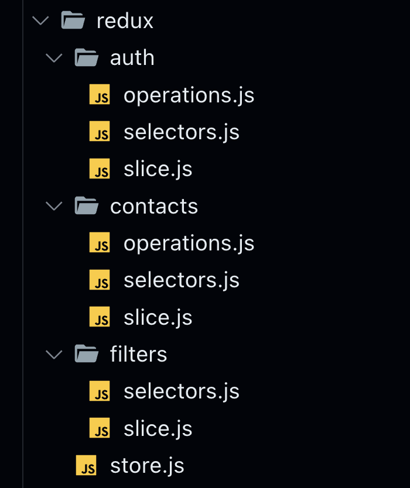

# Tier 4. Module 4: Mastering Front-End Development with React

## Extra Topic - Working with users and authorization

## Homework

### Technical task - Phonebook

Add to the Contact Book application from the homework of the previous module the ability to register and login, as well as work with a private collection of contacts.

#### Backend

There is a ready-made backend with [documentation](https://connections-api.goit.global/docs/) for this task. Use it instead of your backend created through the **mockapi.io** service.

```
https://connections-api.goit.global/
```

It supports all necessary contact collection operations as well as user registration, login and update using JWT.

#### Redux folder structure

Redux will have three slices. You have already implemented `contacts` and `filters`, as well as the new `auth`, which will be responsible for the user's status. For each slice, create a separate folder and files for such entities as operations, selectors, and slice logic.

You should have the following structure:



Move the code from the `contactsSlice.js`, `contactsOps.js`, `filtersSlice.js` files to the new appropriate files.

#### Slice `auth`

Add a new `auth` state of the following structure to Redux:

```
{
  user: {
    name: null,
    email: null,
  },
  token: null,
  isLoggedIn: false,
  isRefreshing: false,
}
```

#### Slice operations `auth`

Add the operations declared with `createAsyncThunk` to the `redux/auth/operations.js` file to work with the user:
* `register` - to register a new user. The base action type is `"auth/register"`. Used in the `RegistrationForm` component on the registration page.
* `login` - for the login of an existing user. The base action type is `"auth/login"`. Used in the `LoginForm` component on the login page.
* `logout` - to exit the application. The base action type is `"auth/logout"`. It is used in the `UserMenu` component in the application header.
* `refreshUser` - update user by token. The base action type is `"auth/refresh"`. Used in the `App` component when it is mounted.

The token of the authorized user must be stored in local storage using the [persist](https://github.com/rt2zz/redux-persist#readme) library.

#### Routing

Add routing with the React Router library. Add page components to the `src/pages` folder. Use the `PrivateRoute` and `RestrictedRoute` components to wrap public and private page components.

The application must have the following routes:

* `/` - the route of the home page of the application, where you can place information about the application or its developer. Renders the `HomePage` component.
* `/register` - a public route for registering a new user, on which the `RegistrationPage` component with the `RegistrationForm` form is rendered.
* `/login` - public route for the login of an existing user, on which the `LoginPage` page component with the `LoginForm` form is rendered.
* `/contacts` - a private route for working with the user's contact list, on which the `ContactsPage` component is rendered.

Create a `Layout` component that will render the `AppBar` component and wrap all the routes to be available on each of them.

The `AppBar` component should render the `Navigation` and `AuthNav` components. At the same time, the authorized user should see `UserMenu` instead of `AuthNav`.

Be sure to clear the contact collection in the state when the user logs out.

When reloading the `/contacts` page, it is necessary to ensure that the user's authorization status is preserved. This means that the system should automatically restore the authorized state of the user without the need to re-enter the login and password.

#### Forms

For login forms (`LoginForm`) and registration (`RegistrationForm`), it is better to use the [Formik](https://formik.org/) library.

#### Additional tasks

This is the final version of the application. Here is a list of ideas for optional additions that can be in the application:

* When entering the contact search text field, filtering is performed not only by name, but also by phone number.
* When deleting a contact, you must confirm the operation through a modal window.
* On successful operations of adding and removing a contact, a message is displayed to the user using [React Hot Toast](https://react-hot-toast.com/).
* Contacts can be edited, the backend supports a PATCH request to update a contact.
* For styling, you can use a component library such as [Material UI](https://mui.com/material-ui/).

### Acceptance criteria

* Main link: the assignment work page on [Vercel](https://vercel.com/).
* The project was created using [Vite](https://vitejs.dev/).
* There should be no errors or warnings in the console when running the task code.
* For each component, there is a separate folder in the `src/components` folder that contains the JSX file of the React component itself and its styles file. The name of the folder, the component file (with the extension `.jsx`) and the style file (before `.module.css`) are the same and correspond to the names specified in the tasks (if there were any).
* For each page in the `src/pages` folder, there is a separate folder that contains the JSX file of the React component itself and its styles file. The name of the folder, the component file (with the extension `.jsx`) and the style file (before `.module.css`) are the same and correspond to the names specified in the tasks (if there were any).
* The JS code is clean and clear, using Prettier.
* Used `Redux Toolkit` library.
* Styling is done by CSS modules.
